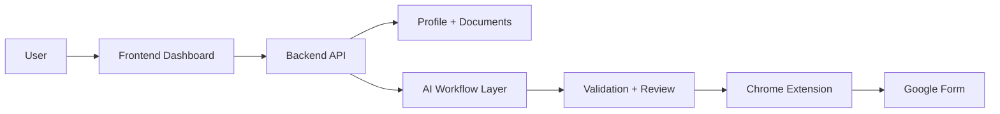

# AgentFlow

AgentFlow is a premium approval-first AI workflow for Google Forms. It helps users prepare grounded answers from their profile, resume, and uploaded documents, then review and fill a live form through a Chrome extension with human approval before submission.

## Overview

The product is built around a clear, safe workflow:

1. User pastes a Google Form URL
2. The app extracts the form questions
3. The backend retrieves profile and document context
4. AI generates answer drafts grounded in user data
5. The user reviews and edits the output
6. The Chrome extension fills the form in the browser without forcing submit

This creates a transparent and approval-driven automation flow for repetitive form work.

---

## Key Features

- AI-powered Google Form analysis
- Grounded answer generation using user profile + documents
- Upload support for resumes and supporting files
- Review and validation flow before approval
- Chrome extension-driven browser filling
- Secure JWT auth flow
- Dashboard, profile, and form history experience
- Modern SaaS-style premium interface

---

## Tech Stack

### Frontend
- React
- Vite
- React Router
- Axios
- Lucide React
- Tailwind-style utility CSS patterns

### Backend
- FastAPI
- Python
- Pydantic schemas
- JWT authentication
- LangGraph orchestration
- Google GenAI integration
- MongoDB-ready configuration
- Pinecone vector retrieval support

### Browser Extension
- Manifest V3
- Chrome extension content scripts
- Background script for message handling
- Active tab and form automation bridge

---

## Full Project Structure

```text
AgentFlow/
├── .gitignore
├── README.md
├── index.html
├── package.json
├── vite.config.js
├── node_modules/
├── dist/
│
├── backend/
│   ├── requirements.txt
│   ├── tests/
│   │   └── test_answer_workflow.py
│   └── app/
│       ├── __init__.py
│       ├── main.py
│       ├── schemas.py
│       ├── agents/
│       │   ├── __init__.py
│       │   ├── answer_critic.py
│       │   ├── answer_generator.py
│       │   ├── graph.py
│       │   ├── question_classifier.py
│       │   ├── retriever.py
│       │   └── validator.py
│       ├── api/
│       │   ├── __init__.py
│       │   ├── auth.py
│       │   ├── documents.py
│       │   ├── forms.py
│       │   ├── history.py
│       │   └── profile.py
│       ├── core/
│       │   └── config.py
│       └── services/
│           ├── __init__.py
│           ├── document_ingestion.py
│           ├── pinecone_store.py
│           ├── store.py
│           └── vector_store.py
│
├── frontend/
│   ├── index.html
│   ├── package.json
│   ├── vite.config.js
│   └── src/
│       ├── App.jsx
│       ├── index.css
│       ├── main.jsx
│       ├── components/
│       │   ├── LayoutNew.jsx
│       │   └── ui/
│       │       └── index.jsx
│       ├── pages/
│       │   ├── Dashboard.jsx
│       │   ├── DashboardNew.jsx
│       │   ├── FormAnalysis.jsx
│       │   ├── FormAnalysisNew.jsx
│       │   ├── History.jsx
│       │   ├── HistoryNew.jsx
│       │   ├── Login.jsx
│       │   ├── Profile.jsx
│       │   ├── ProfileNew.jsx
│       │   ├── Register.jsx
│       │   ├── ReviewAnswers.jsx
│       │   └── ReviewAnswersNew.jsx
│       └── services/
│           └── api.js
│
└── extension/
    ├── background.js
    ├── content.js
    └── manifest.json
```

---

## Architecture Overview



### Main Modules

- Frontend: login, dashboard, profile, history, and review screens
- Backend: auth, profile, form analysis, document ingestion, and history APIs
- AI layer: form question classification, retrieval, answer generation, and validation
- Extension: fills reviewed answers into the active Google Form

---

## Backend Modules

The backend organizes logic into a few key areas:

```text
backend/app/
├── agents/
│   ├── answer_critic.py
│   ├── answer_generator.py
│   ├── graph.py
│   ├── question_classifier.py
│   ├── retriever.py
│   └── validator.py
├── api/
│   ├── auth.py
│   ├── documents.py
│   ├── forms.py
│   ├── history.py
│   └── profile.py
├── core/
│   └── config.py
├── services/
│   ├── document_ingestion.py
│   ├── pinecone_store.py
│   ├── store.py
│   └── vector_store.py
```

These modules support the AI reasoning flow:

- classify questions
- retrieve relevant profile/document context
- generate grounded answers
- validate quality before approval

---

## Frontend App Structure

```text
frontend/src/
├── App.jsx
├── components/
│   ├── LayoutNew.jsx
│   └── ui/
│       └── index.jsx
├── pages/
│   ├── DashboardNew.jsx
│   ├── FormAnalysisNew.jsx
│   ├── HistoryNew.jsx
│   ├── Login.jsx
│   ├── ProfileNew.jsx
│   ├── Register.jsx
│   └── ReviewAnswersNew.jsx
├── services/
│   └── api.js
```

The frontend uses a protected route layout with sidebar navigation and premium, dashboard-first presentation.

---

## Environment Setup

### Backend environment

Create a `.env` file inside `backend`:

```env
GEMINI_API_KEY=your_google_gemini_key
GEMINI_MODEL=gemini-2.5-flash
MONGODB_URI=mongodb://localhost:27017
MONGODB_DATABASE=agentflow
JWT_SECRET=your_secret_key
FRONTEND_ORIGIN=http://localhost:5173
PINECONE_API_KEY=your_pinecone_key
PINECONE_INDEX_NAME=agentworkflow
```

### Frontend environment

Create a `.env.local` file inside `frontend`:

```env
VITE_EXTENSION_ID=your_chrome_extension_id
```

---

## Local Development

### 1) Start backend

```bash
cd backend
python -m venv .venv
# Windows
.\.venv\Scripts\activate
# macOS/Linux
source .venv/bin/activate
pip install -r requirements.txt
uvicorn app.main:app --reload --port 8000
```

### 2) Start frontend

```bash
cd frontend
npm install
npm run dev
```

### 3) Load the Chrome extension

1. Open `chrome://extensions`
2. Enable Developer mode
3. Click `Load unpacked`
4. Select the `extension` folder
5. Copy the extension ID into the frontend env file
6. Open a Google Form and test the fill flow

---

## API Flow

The backend exposes routes for:

- Authentication
- Profile retrieval and update
- Form analysis and generation
- Document upload and retrieval
- History tracking

This is implemented in the `backend/app/api` folder.

---

## Working Logic

### User workflow

```text
Paste form URL
   ↓
Extract questions
   ↓
Fetch user profile + docs
   ↓
Generate answers
   ↓
Review + edit answers
   ↓
Fill form using extension
```

### Important design principle

The extension fills approved answers into the form but does not automatically submit the form. This keeps the flow human-controlled and safe.

---

## Testing

There is a test suite for workflow validation:

```text
backend/tests/test_answer_workflow.py
```

Run:

```bash
cd backend
pytest
```

---

## Notes

- The app supports local demo mode and can be extended to production-grade storage/AI services
- This repo combines frontend, backend, and browser-extension functionality in one workspace for a complete product flow
- The codebase is structured to be expanded for production deployments, advanced retrieval, and richer multi-step AI logic

---

## License

This project is currently intended for internal or educational use unless otherwise stated by the repository owner.
